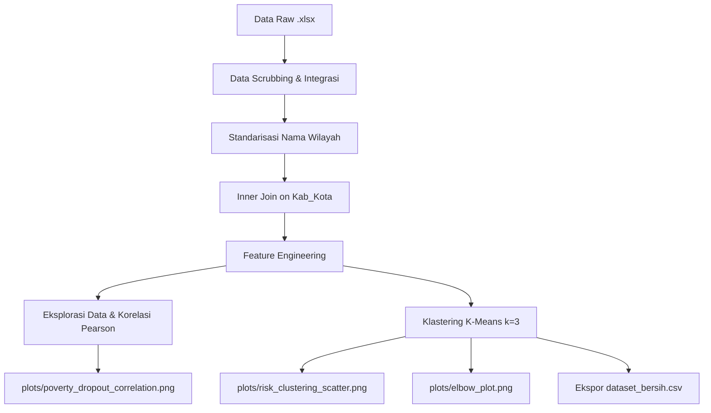

# Analisis Spasial & Klastering Risiko Putus Sekolah di Jawa Barat 🎓📉

[](https://www.python.org/)
[](https://jupyter.org/)
[](https://opensource.org/licenses/MIT)

Repository ini berisi proyek analisis data mengenai keterkaitan antara tingkat kemiskinan, Indeks Pembangunan Manusia (IPM), dan angka putus sekolah di tingkat Kabupaten/Kota Provinsi Jawa Barat tahun 2024. Proyek ini dibuat untuk memenuhi Tugas Besar mata kuliah **II4013 Data Analytics** (Semester 6).

---

## 👥 Kelompok 9 - Anggota Tim

| Nama | NIM | Peran / Jobdesk |
| :--- | :---: | :--- |
| **Muhammad Zidni Alkindi** | 18223071 | Data Analyst / Modeler |
| **Arqila Surya Putra** | 18223047 | Data Analyst / Modeler |
| **Andhika Maulana A** | 18223005 | Visualization / Dashboard Developer |
| **Muhammad Naufal Fathan** | 18223059 | Documentation and Insight Lead |
| **Muhammad Farhan** | 18223004 | Data Engineer |

---

## 📌 Deskripsi Proyek & Metodologi

Proyek ini menggunakan metodologi **OSEMN** (*Obtain, Scrub, Explore, Model, Interpret*) untuk menganalisis dan memetakan tingkat kerentanan putus sekolah di 27 Kabupaten/Kota Provinsi Jawa Barat. 

### Alur Kerja Data (Workflow)



### Penjelasan Tahapan Proyek:

1. **Obtain**: Mengambil data sekunder dari BPS Jawa Barat dan Dinas Pendidikan Jawa Barat tahun 2024:
   - Indeks Pembangunan Manusia (IPM) Provinsi Jawa Barat 2024.
   - Jumlah dan Persentase Penduduk Miskin menurut Kabupaten/Kota di Jawa Barat 2024.
   - Data Putus Sekolah Jawa Barat jenjang SD, SMP, SMA, SMK, dan SLB.
2. **Scrub**: 
   - Memilih 27 baris data Kabupaten/Kota Jawa Barat yang sesuai standar wilayah administratif.
   - Menghapus kolom kosong (misalnya data kemiskinan bulan September yang tidak tersedia).
   - Menyelaraskan penamaan wilayah menjadi format seragam (`Kab. <Nama>` dan `Kota <Nama>`).
   - Melakukan penggabungan data (*inner join*) secara presisi tanpa ada nilai yang hilang (*zero null-values* setelah penggabungan).
3. **Feature Engineering**: Membuat metrik analisis baru:
   - `Total_Putus_Sekolah`: Akumulasi angka putus sekolah di semua jenjang pendidikan.
   - `Jumlah_Miskin_Jiwa`: Konversi persentase penduduk miskin menjadi total jiwa.
   - `Estimasi_Total_Penduduk`: Estimasi total penduduk wilayah berdasarkan data kemiskinan.
   - `Putus_Sekolah_per_10k_Penduduk`: Normalisasi angka putus sekolah per 10.000 penduduk untuk perbandingan wilayah yang adil.
4. **Explore**: Menganalisis korelasi statistik menggunakan Pearson Correlation. Hasil korelasi menunjukkan nilai **r = 0.3944** dengan **p-value = 0.0418** (korelasi positif tingkat moderat yang signifikan secara statistik).
5. **Model**: Melakukan segmentasi wilayah menggunakan algoritma **K-Means Clustering** dengan fitur: `Putus_Sekolah_per_10k_Penduduk`, `Persentase_Miskin_Maret`, dan `IPM_2024`.
   - Menggunakan Elbow Method untuk menentukan jumlah klaster optimal ($k=3$).
   - Menghitung *Silhouette Score* sebesar **0.450+**.
   - Melakukan pelabelan tingkat kerentanan: **Risiko Tinggi**, **Risiko Sedang**, dan **Risiko Rendah**.

---

## 📁 Struktur Direktori

```text
Tubes/
├── data/
│   ├── raw/
│   │   ├── Indeks Pembangunan Manusia Provinsi Jawa Barat 2024.xlsx
│   │   ├── Jumlah dan Persentase Penduduk Miskin Menurut Kabupaten_Kota...xlsx
│   │   └── Tab-Putus-Sekolah.xlsx
│   └── clean/
│       └── dataset_bersih.csv
├── plots/
│   ├── data_quality_report.txt
│   ├── elbow_plot.png
│   ├── poverty_dropout_correlation.png
│   └── risk_clustering_scatter.png
├── analysis.ipynb
├── pipeline.py
├── Kelompok 9.pdf
├── 1779174569814_Panduan_Tugas_Besar_Data_Analitik.pdf
└── README.md
```

---

## 📈 Visualisasi & Hasil Utama

Seluruh plot visualisasi hasil analisis disimpan pada folder `plots/`. Berikut rincian visualisasi yang dihasilkan:

1. **Scatter Plot Korelasi**: Menampilkan korelasi antara persentase kemiskinan dengan angka putus sekolah per 10k penduduk, lengkap dengan garis regresi linier.
   - Lokasi: [plots/poverty_dropout_correlation.png](file:///Users/zidnialkindi/Documents/College/6th%20Semester/Data%20Analytics/Tubes/plots/poverty_dropout_correlation.png)
2. **Elbow Plot**: Digunakan untuk validasi jumlah klaster optimal dengan menghitung inersia.
   - Lokasi: [plots/elbow_plot.png](file:///Users/zidnialkindi/Documents/College/6th%20Semester/Data%20Analytics/Tubes/plots/elbow_plot.png)
3. **Cluster Scatter Plot**: Visualisasi hasil pengelompokan 3 wilayah kerentanan (Merah: Risiko Tinggi, Jingga: Risiko Sedang, Hijau: Risiko Rendah) dengan ukuran titik mewakili pencapaian IPM.
   - Lokasi: [plots/risk_clustering_scatter.png](file:///Users/zidnialkindi/Documents/College/6th%20Semester/Data%20Analytics/Tubes/plots/risk_clustering_scatter.png)

### 📊 Profil Klaster Kerentanan (Rata-rata)

| Tingkat Kerentanan | Putus Sekolah / 10k Penduduk | Persentase Kemiskinan (%) | IPM 2024 | Rerata Total Putus Sekolah |
| :--- | :---: | :---: | :---: | :---: |
| **Risiko Tinggi** | 1.63 | 10.37 | 70.47 | 289 siswa |
| **Risiko Sedang** | 1.15 | 6.84 | 74.83 | 240 siswa |
| **Risiko Rendah** | 0.49 | 3.65 | 81.35 | 82 siswa |

> [!NOTE]
> Wilayah **Risiko Tinggi** didominasi oleh kabupaten dengan persentase penduduk miskin di atas rata-rata provinsi dan IPM yang berada di bawah rata-rata. Penanganan khusus pada wilayah ini sangat diprioritaskan.

---

## 🚀 Cara Menjalankan Proyek

### Prasyarat (Dependencies)
Pastikan Anda sudah menginstal Python (minimal 3.8) dan pustaka berikut:
```bash
pip install pandas numpy openpyxl matplotlib seaborn scikit-learn scipy
```

### Menjalankan via Script Python
Untuk menjalankan seluruh *data pipeline* dari tahap pembersihan hingga penyimpanan gambar visualisasi, gunakan perintah berikut di terminal:
```bash
python pipeline.py
```

### Menjalankan via Jupyter Notebook
Untuk eksplorasi interaktif beserta penjelasan markdown yang lengkap, buka Jupyter Notebook dan jalankan file `analysis.ipynb`:
```bash
jupyter notebook analysis.ipynb
```

---

## 📄 Laporan Kualitas Data

Berdasarkan analisis IQR (*Interquartile Range*) yang tersimpan di [plots/data_quality_report.txt](file:///Users/zidnialkindi/Documents/College/6th%20Semester/Data%20Analytics/Tubes/plots/data_quality_report.txt), parameter pembersihan data berjalan dengan sangat baik:
- Penggabungan data menghasilkan **27 baris** (tepat mewakili 27 Kabupaten/Kota di Jawa Barat).
- Tidak ditemukan data pencilan (*outliers*) ekstrim pada variabel `Total_Putus_Sekolah`, `Persentase_Miskin_Maret`, maupun `IPM_2024` setelah dilakukan normalisasi.
